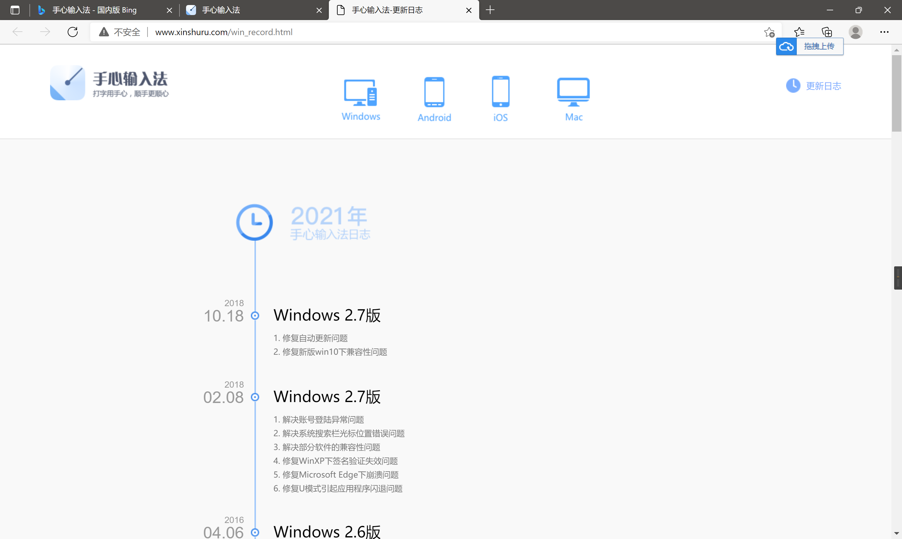
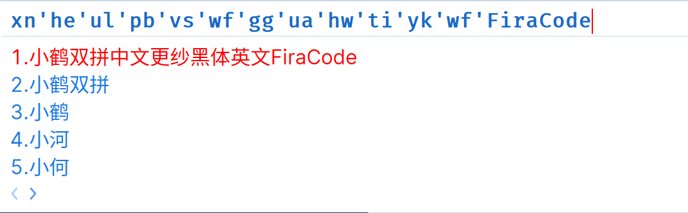
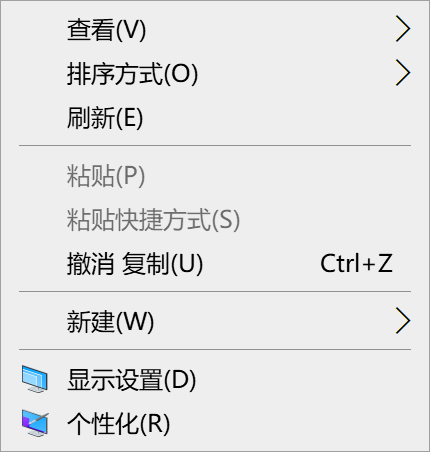
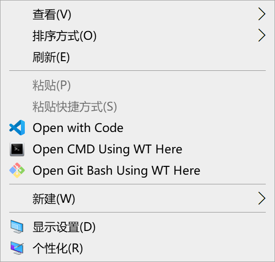
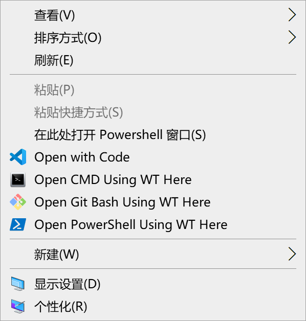
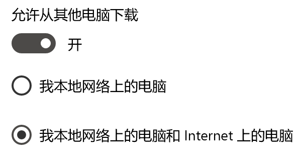
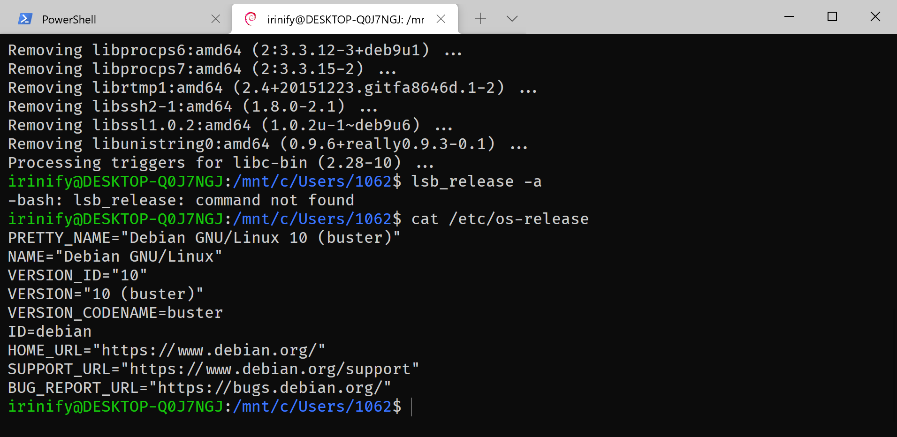
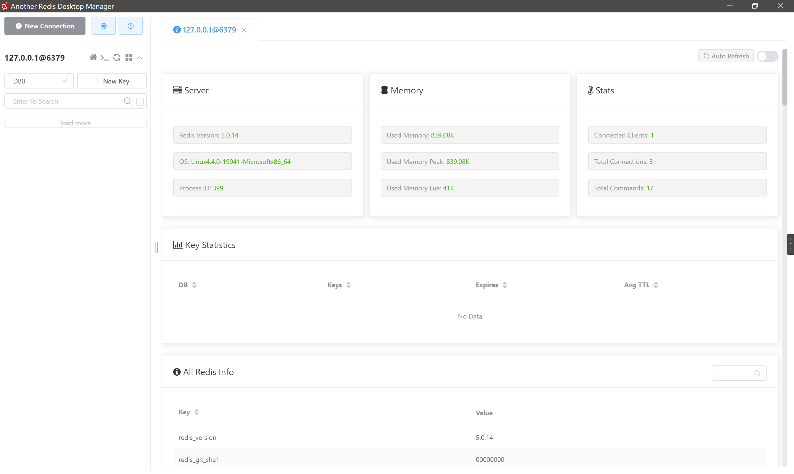

# 完美主义者的 Win10 装机指南

电脑用久了之后，会变得很卡，各种文件乱七八糟的占满c盘，都不知道该如何清理。因此，养成良好的使用习惯，定期重装系统，是提升工作效率和乐趣的重要一环。但是电脑上个人文件和微信QQ传送的文件经年累月的累积下来，不好整理也无法丢弃。各种软件破解，开发相关的环境配置，都让你害怕而一再向卡慢的电脑妥协。

本指南意在探索 Win10 最舒适的重装工作流和配置习惯。

### 1 良好的电脑使用习惯

工作向文件通过坚果云同步，office文档通过WPS云同步自动上传

微信QQ聊天记录周期性备份到电脑端，然后再同步到天翼云盘

C盘空间给大，有注册表写入的，重装系统会重装的软件，直接放C盘

绿色软件、个人文档、游戏资料库（如 steam库，战网游戏）放其他盘，重装系统不受影响

### 2 固化装机流程

#### 2.1 装系统

准备U盘，用 WePE 格盘

[系统镜像站](https://next.itellyou.cn/Original/Index#)

#### 2.2 装手心输入法、火绒

[手心输入法](https://www.xinshuru.com/) 最新版本 v2.7(2018)



[火绒](https://www.huorong.cn/) —— 根据需要添加弹窗拦截、垃圾清理、启动项管理、右键管理、流量浮窗

#### 2.3 装驱动

直接去官网下载

#### 2.4 激活、个性化设置、dism++ 设置

https://kms.cangshui.net/

> 2021-11-20 更新脚本：支持visio和project激活，添加Windows 10 LTSC 2021 激活。

[Office Tool Plus](https://otp.landian.vip/zh-cn/)

桌面图标按修改日期排序，最新的文件会排在最后，方便找到

#### 2.5 装 Clash，Chrome

绿色版 Clash 装在非C盘，重装系统后可以继续用，但是要重新导入配置文件，记住一定要从界面导入，而不是直接把文件复制到 config 文件夹

Chrome 首次进入时需要通过命令行启用 proxy

从桌面图标进入安装目录，在地址栏输入 cmd 启动命令行，然后用下方指令启动程序

`chrome --proxy-server="socks5://127.0.0.1:7890"`

然后登录账号，自动同步

#### 2.6 装 Scoop、常用软件

**Scoop**

[Using Scoop behind a proxy](https://github.com/ScoopInstaller/Scoop/wiki/Using-Scoop-behind-a-proxy)

PowerShell must be enabled for your user account e.g. 

`Set-ExecutionPolicy -ExecutionPolicy RemoteSigned -Scope CurrentUser`

PowerShell 启用代理

```bash
# If you want to use a proxy that isn't already configured in Internet Options
[net.webrequest]::defaultwebproxy = new-object net.webproxy "127.0.0.1:7890"
```

Run the following command from your PowerShell to install scoop to its default location (`C:\Users\<user>\scoop`)

```bash
Invoke-Expression (New-Object System.Net.WebClient).DownloadString('https://get.scoop.sh')

# or shorter
iwr -useb get.scoop.sh | iex
```

给 Scoop 配置代理

```bash
# anonymous authentication to proxy.example.org on port 8080:
scoop config proxy 127.0.0.1:7890
```

初次安装之后我们可以通过运行 `scoop checkup` 来检测当前潜在问题，然后根据提示进行修正

各种安装，各种嗨（执行install时轻易不要加global）

```bash
scoop install sudo
sudo scoop install 7zip git openssh --global
scoop install aria2 curl grep sed less touch
# 装一些不需要写注册表的软件
scoop bucket add extras
scoop install everything keepassxc SumatraPDF typora snipaste vscode vcredist2019 windows-terminal
# 安装字体
scoop bucket add nerd-fonts
scoop install Source-Han-Sans-SC # 思源黑
scoop install Source-Han-Serif-SC # 思源宋
scoop install SarasaGothic-SC # 安装更纱黑体（简体中文）
scoop install Wenquanyi-Microhei # 安装文泉驿微米黑
scoop install Wenquanyi-Zenhei # 安装文泉驿正黑
```

安装字体之后，给输入法替换显示字体

yoga 14s 2880x1800 200% 缩放下显示效果如下



**SwitchHosts** 

`sudo scoop install switchhosts`

==需要给原版 hosts 文件添加写入权限才能对其进行操作==

```bash
# My hosts
# raw.githubusercontent.com
185.199.108.133 raw.githubusercontent.com user-images.githubusercontent.com avatars2.githubusercontent.com avatars1.githubusercontent.com
185.199.109.133 raw.githubusercontent.com user-images.githubusercontent.com avatars2.githubusercontent.com avatars1.githubusercontent.com
185.199.110.133 raw.githubusercontent.com user-images.githubusercontent.com avatars2.githubusercontent.com avatars1.githubusercontent.com
185.199.111.133 raw.githubusercontent.com user-images.githubusercontent.com avatars2.githubusercontent.com avatars1.githubusercontent.com

# wikipedia.org
208.80.153.224 wikipedia.org
2620:0:860:ed1a::1 wikipedia.org

# short url
134.64.115.91 r.tt
127.0.0.1 l.tt
```

**配置 Windows Terminal**

settings.json 配置供参考

```bash
{
    "$schema": "https://aka.ms/terminal-profiles-schema",
    "actions": 
    [
        {
            "command": 
            {
                "action": "copy",
                "singleLine": false
            },
            "keys": "ctrl+c"
        },
        {
            "command": "paste",
            "keys": "ctrl+v"
        },
        {
            "command": "find",
            "keys": "ctrl+shift+f"
        },
        {
            "command": 
            {
                "action": "splitPane",
                "split": "auto",
                "splitMode": "duplicate"
            },
            "keys": "alt+shift+d"
        }
    ],
    "copyFormatting": "none",
    "copyOnSelect": false,
    "defaultProfile": "{61c54bbd-c2c6-5271-96e7-009a87ff44bf}",
    "experimental.rendering.software": true,
    "profiles": 
    {
        "defaults": 
        {
            "antialiasingMode": "cleartype",
            "font": 
            {
                "face": "Fira Code Retina",
                "size": 12
            }
        },
        "list": 
        [
            {
                "commandline": "powershell.exe",
                "guid": "{61c54bbd-c2c6-5271-96e7-009a87ff44bf}",
                "hidden": false,
                "name": "PowerShell"
            },
            {
                "commandline": "cmd.exe",
                "guid": "{0caa0dad-35be-5f56-a8ff-afceeeaa6101}",
                "hidden": false,
                "name": "cmd"
            },
            {
                "acrylicOpacity": 0.75,
                "closeOnExit": "graceful",
                "colorScheme": "GitBash",
                "commandline": "C:\\Users\\1062\\scoop\\apps\\git\\current\\bin\\bash.exe --login -i -l",
                "cursorColor": "#FFFFFF",
                "cursorShape": "bar",
                "font": 
                {
                    "face": "Consolas",
                    "size": 10
                },
                "guid": "{00000000-0000-0000-0000-000000000001}",
                "historySize": 9001,
                "icon": "C:\\Users\\1062\\scoop\\apps\\git\\current\\mingw64\\share\\git\\git-for-windows.ico",
                "name": "GitBash",
                "padding": "0, 0, 0, 0",
                "snapOnInput": true,
                "startingDirectory": "%USERPROFILE%",
                "useAcrylic": false
            },
            {
                "guid": "{b453ae62-4e3d-5e58-b989-0a998ec441b8}",
                "hidden": false,
                "name": "Azure Cloud Shell",
                "source": "Windows.Terminal.Azure"
            }
        ]
    },
    "schemes": 
    [
        {
            "background": "#0C0C0C",
            "black": "#0C0C0C",
            "blue": "#0037DA",
            "brightBlack": "#767676",
            "brightBlue": "#3B78FF",
            "brightCyan": "#61D6D6",
            "brightGreen": "#16C60C",
            "brightPurple": "#B4009E",
            "brightRed": "#E74856",
            "brightWhite": "#F2F2F2",
            "brightYellow": "#F9F1A5",
            "cursorColor": "#FFFFFF",
            "cyan": "#3A96DD",
            "foreground": "#CCCCCC",
            "green": "#13A10E",
            "name": "Campbell",
            "purple": "#881798",
            "red": "#C50F1F",
            "selectionBackground": "#FFFFFF",
            "white": "#CCCCCC",
            "yellow": "#C19C00"
        },
        {
            "background": "#012456",
            "black": "#0C0C0C",
            "blue": "#0037DA",
            "brightBlack": "#767676",
            "brightBlue": "#3B78FF",
            "brightCyan": "#61D6D6",
            "brightGreen": "#16C60C",
            "brightPurple": "#B4009E",
            "brightRed": "#E74856",
            "brightWhite": "#F2F2F2",
            "brightYellow": "#F9F1A5",
            "cursorColor": "#FFFFFF",
            "cyan": "#3A96DD",
            "foreground": "#CCCCCC",
            "green": "#13A10E",
            "name": "Campbell Powershell",
            "purple": "#881798",
            "red": "#C50F1F",
            "selectionBackground": "#FFFFFF",
            "white": "#CCCCCC",
            "yellow": "#C19C00"
        },
        {
            "background": "#000000",
            "black": "#0C0C0C",
            "blue": "#6060FF",
            "brightBlack": "#767676",
            "brightBlue": "#3B78FF",
            "brightCyan": "#61D6D6",
            "brightGreen": "#16C60C",
            "brightPurple": "#B4009E",
            "brightRed": "#E74856",
            "brightWhite": "#F2F2F2",
            "brightYellow": "#F9F1A5",
            "cursorColor": "#FFFFFF",
            "cyan": "#3A96DD",
            "foreground": "#BFBFBF",
            "green": "#00A400",
            "name": "GitBash",
            "purple": "#BF00BF",
            "red": "#BF0000",
            "selectionBackground": "#FFFFFF",
            "white": "#FFFFFF",
            "yellow": "#BFBF00"
        },
        {
            "background": "#282C34",
            "black": "#282C34",
            "blue": "#61AFEF",
            "brightBlack": "#5A6374",
            "brightBlue": "#61AFEF",
            "brightCyan": "#56B6C2",
            "brightGreen": "#98C379",
            "brightPurple": "#C678DD",
            "brightRed": "#E06C75",
            "brightWhite": "#DCDFE4",
            "brightYellow": "#E5C07B",
            "cursorColor": "#FFFFFF",
            "cyan": "#56B6C2",
            "foreground": "#DCDFE4",
            "green": "#98C379",
            "name": "One Half Dark",
            "purple": "#C678DD",
            "red": "#E06C75",
            "selectionBackground": "#FFFFFF",
            "white": "#DCDFE4",
            "yellow": "#E5C07B"
        },
        {
            "background": "#FAFAFA",
            "black": "#383A42",
            "blue": "#0184BC",
            "brightBlack": "#4F525D",
            "brightBlue": "#61AFEF",
            "brightCyan": "#56B5C1",
            "brightGreen": "#98C379",
            "brightPurple": "#C577DD",
            "brightRed": "#DF6C75",
            "brightWhite": "#FFFFFF",
            "brightYellow": "#E4C07A",
            "cursorColor": "#4F525D",
            "cyan": "#0997B3",
            "foreground": "#383A42",
            "green": "#50A14F",
            "name": "One Half Light",
            "purple": "#A626A4",
            "red": "#E45649",
            "selectionBackground": "#FFFFFF",
            "white": "#FAFAFA",
            "yellow": "#C18301"
        },
        {
            "background": "#002B36",
            "black": "#002B36",
            "blue": "#268BD2",
            "brightBlack": "#073642",
            "brightBlue": "#839496",
            "brightCyan": "#93A1A1",
            "brightGreen": "#586E75",
            "brightPurple": "#6C71C4",
            "brightRed": "#CB4B16",
            "brightWhite": "#FDF6E3",
            "brightYellow": "#657B83",
            "cursorColor": "#FFFFFF",
            "cyan": "#2AA198",
            "foreground": "#839496",
            "green": "#859900",
            "name": "Solarized Dark",
            "purple": "#D33682",
            "red": "#DC322F",
            "selectionBackground": "#FFFFFF",
            "white": "#EEE8D5",
            "yellow": "#B58900"
        },
        {
            "background": "#FDF6E3",
            "black": "#002B36",
            "blue": "#268BD2",
            "brightBlack": "#073642",
            "brightBlue": "#839496",
            "brightCyan": "#93A1A1",
            "brightGreen": "#586E75",
            "brightPurple": "#6C71C4",
            "brightRed": "#CB4B16",
            "brightWhite": "#FDF6E3",
            "brightYellow": "#657B83",
            "cursorColor": "#002B36",
            "cyan": "#2AA198",
            "foreground": "#657B83",
            "green": "#859900",
            "name": "Solarized Light",
            "purple": "#D33682",
            "red": "#DC322F",
            "selectionBackground": "#FFFFFF",
            "white": "#EEE8D5",
            "yellow": "#B58900"
        },
        {
            "background": "#000000",
            "black": "#000000",
            "blue": "#3465A4",
            "brightBlack": "#555753",
            "brightBlue": "#729FCF",
            "brightCyan": "#34E2E2",
            "brightGreen": "#8AE234",
            "brightPurple": "#AD7FA8",
            "brightRed": "#EF2929",
            "brightWhite": "#EEEEEC",
            "brightYellow": "#FCE94F",
            "cursorColor": "#FFFFFF",
            "cyan": "#06989A",
            "foreground": "#D3D7CF",
            "green": "#4E9A06",
            "name": "Tango Dark",
            "purple": "#75507B",
            "red": "#CC0000",
            "selectionBackground": "#FFFFFF",
            "white": "#D3D7CF",
            "yellow": "#C4A000"
        },
        {
            "background": "#FFFFFF",
            "black": "#000000",
            "blue": "#3465A4",
            "brightBlack": "#555753",
            "brightBlue": "#729FCF",
            "brightCyan": "#34E2E2",
            "brightGreen": "#8AE234",
            "brightPurple": "#AD7FA8",
            "brightRed": "#EF2929",
            "brightWhite": "#EEEEEC",
            "brightYellow": "#FCE94F",
            "cursorColor": "#000000",
            "cyan": "#06989A",
            "foreground": "#555753",
            "green": "#4E9A06",
            "name": "Tango Light",
            "purple": "#75507B",
            "red": "#CC0000",
            "selectionBackground": "#FFFFFF",
            "white": "#D3D7CF",
            "yellow": "#C4A000"
        },
        {
            "background": "#000000",
            "black": "#000000",
            "blue": "#000080",
            "brightBlack": "#808080",
            "brightBlue": "#0000FF",
            "brightCyan": "#00FFFF",
            "brightGreen": "#00FF00",
            "brightPurple": "#FF00FF",
            "brightRed": "#FF0000",
            "brightWhite": "#FFFFFF",
            "brightYellow": "#FFFF00",
            "cursorColor": "#FFFFFF",
            "cyan": "#008080",
            "foreground": "#C0C0C0",
            "green": "#008000",
            "name": "Vintage",
            "purple": "#800080",
            "red": "#800000",
            "selectionBackground": "#FFFFFF",
            "white": "#C0C0C0",
            "yellow": "#808000"
        }
    ]
}
```

**添加右键快捷方式，方便后面编辑文档**

默认右键



需要替换文件路径、wt.exe -p %变量名需要和wt的settings.json一致%

脚本需要保存为 .reg 格式之后执行

```bash
Windows Registry Editor Version 5.00

[HKEY_CLASSES_ROOT\Directory\Background\shell\wt-cmd]
 @="Open CMD Using WT Here"
 "Icon"="C:\\Users\\1062\\AppData\\Local\\ico\\cmd.ico"
 
[HKEY_CLASSES_ROOT\Directory\Background\shell\wt-cmd\command]
 @="C:\\Users\\1062\\scoop\\apps\\windows-terminal\\current\\wt.exe -p cmd -d ."

 
[HKEY_CLASSES_ROOT\Directory\Background\shell\wt-gitbash]
 @="Open Git Bash Using WT Here"
 "Icon"="C:\\Users\\1062\\AppData\\Local\\ico\\git.ico"

[HKEY_CLASSES_ROOT\Directory\Background\shell\wt-gitbash\command]
 @="C:\\Users\\1062\\scoop\\apps\\windows-terminal\\current\\wt.exe -p GitBash -d ."
 

[HKEY_CLASSES_ROOT\Directory\Background\shell\wt-ps]
 @="Open PowerShell Using WT Here"
 "Extended"=""
 "Icon"="C:\\Users\\1062\\AppData\\Local\\ico\\ps.ico"

[HKEY_CLASSES_ROOT\Directory\Background\shell\wt-ps\command]
 @="C:\\Users\\1062\\scoop\\apps\\windows-terminal\\current\\wt.exe -p PowerShell -d ."
 


[HKEY_CLASSES_ROOT\*\shell\scoop-vscode]
@="Open with Code"
"Icon"="C:\\Users\\1062\\scoop\\apps\\vscode\\current\\Code.exe"
[HKEY_CLASSES_ROOT\*\shell\scoop-vscode\command]
@="\"C:\\Users\\1062\\scoop\\apps\\vscode\\current\\Code.exe\" \"%1\""

[HKEY_CLASSES_ROOT\Directory\shell\scoop-vscode]
@="Open with Code"
"Icon"="C:\\Users\\1062\\scoop\\apps\\vscode\\current\\Code.exe"
[HKEY_CLASSES_ROOT\Directory\shell\scoop-vscode\command]
@="\"C:\\Users\\1062\\scoop\\apps\\vscode\\current\\Code.exe\" \"%V\""

[HKEY_CLASSES_ROOT\Directory\Background\shell\scoop-vscode]
@="Open with Code"
"Icon"="C:\\Users\\1062\\scoop\\apps\\vscode\\current\\Code.exe"
[HKEY_CLASSES_ROOT\Directory\Background\shell\scoop-vscode\command]
@="\"C:\\Users\\1062\\scoop\\apps\\vscode\\current\\Code.exe\" \"%V\""

[HKEY_CLASSES_ROOT\Directory\Background\shell\scoop-vscode]
@="Open with Code"
"Icon"="C:\\Users\\1062\\scoop\\apps\\vscode\\current\\Code.exe"
[HKEY_CLASSES_ROOT\Directory\Background\shell\scoop-vscode\command]
@="\"C:\\Users\\1062\\scoop\\apps\\vscode\\current\\Code.exe\" \"%V\""

```

完成版右键菜单



按住 `shift` 后的右键菜单



**Typora**

Typora 换主题，官网下载 bluebook

注释 bluebook.css :426，防止代码段序号和内容之间的巨大缩进

**坚果云**

https://www.jianguoyun.com/

免费版：上传流量1G/月 下载流量3G/月

不想同步的文件夹会采用云桥模式，用到才下载

本地未删除备份可以直接进行文件比对，可能需要处理文件冲突

**QQ 微信**

**WPS**

目前还是用WPS，同时解决office、看图、看PDF

**改装版360极速浏览器（工作需要）**

`360Chrome_12.0.1053.0` 强制管理员权限才能启动

> 方法一：找到安装文件夹（不知道安装在哪里的话可以右键-打开文件所在位置），然后向上回退到360Chrome文件夹，右键360Chrome文件夹-安全-编辑，给Users完全控制权限就可以了，不好使的话编辑界面里给所有选项完全控制权限就可以了。
> 方法二：找到exe文件（右键桌面上的快捷方式-打开文件所在位置），右键-属性-兼容性-以管理员身份运行此程序，这样有个缺点，就是每次打开浏览器的时候都蹦出一个界面让你点确定。
> 我猜是因为把浏览器安装到了C盘下Program Files文件夹带来的后果，权限没能给到位。

#### 2.7 开发工具安装配置

**JetBrains 全家桶**

https://www.jetbrains.com/

一键安装，一键同步配置、插件 超赞！

**Maven**

使用 IDEA 自带

用个人的配置文件覆盖全局的，仓库地址一般放到C盘外

`%user_home%\.m2\settings.xml`

`D:\dev\.m2\repository`

**Github with SSH key**

Install

First up, install the programs you need:

```bash
scoop install git openssh
```

Create a private key

If you don't already have an SSH key, you can create one like this:

```bash
PS> ssh-keygen
Generating public/private rsa key pair.
Enter file in which to save the key (/c/Users/you//.ssh/id_rsa): [press enter]
Enter passphrase (empty for no passphrase): [type your password]
Enter same passphrase again: [and once more]
...
```

Then [add your SSH key to GitHub](https://help.github.com/en/articles/adding-a-new-ssh-key-to-your-github-account).

Test it out

To make sure everything's working, run:

```bash
ssh -T git@github.com
```

After a warning or two, you should see a message like this:

```
Hi <username>! You've successfully authenticated, but GitHub does not provide shell access. 
```

**安装 Nodejs**

nvm & nodejs

```bash
scoop search nvm
scoop install nvm
nvm v
nvm install lts
nvm current
# use 指令必须要用管理员权限执行，不然会报 exit code 1 错误
sudo nvm use $version$
```

npm

```bash
npm config list //查看基本配置
npm config list -l //查看所有配置

# 获取全局安装的默认目录
npm config get prefix
# 设置全局安装的默认目录
npm config set prefix "D:\dev\nodejs\node_global"
npm config set cache "D:\dev\nodejs\node_cache"
# 在全局目录下安装一个npm，然后就不用node自带的npm了
npm install npm -g
```

系统变量 -> 新建变量`NODE_PATH ：D:\dev\nodejs\node_global\node_modules`

用户变量 -> Path 添加 `D:\dev\nodejs\node_global`

现在执行 npm -v 会发现已经是全局目录下的npm了

安装cnpm

```bash
npm install cnpm -g --registry=https://registry.npmmirror.com
```

安装nrm(npm registry manager ) NPM的镜像源管理工具

```bash
npm install nrm -g
nrm ls
nrm test
nrm use tencent
```

**MySQL**

安装完毕先修改my.ini 配置文件，然后安装服务，初始化MySQL，登录改密码

```ini
[mysqld]
basedir=C:/Users/1062/scoop/persist/mysql
datadir=C:/Users/1062/scoop/persist/mysql/data
port = 3306

# Remove leading # to set options mainly useful for reporting servers.
# The server defaults are faster for transactions and fast SELECTs.
# Adjust sizes as needed, experiment to find the optimal values.
# join_buffer_size = 128M
# sort_buffer_size = 2M
# read_rnd_buffer_size = 2M 
 
sql_mode=NO_ENGINE_SUBSTITUTION,STRICT_TRANS_TABLES 
 
character-set-server = utf8mb4
 
performance_schema_max_table_instances = 600
table_definition_cache = 400
table_open_cache = 256

[mysql]
default-character-set = utf8mb4
[client]
user=root
default-character-set = utf8mb4

```

```bash
# 安装MySQL服务
mysqld --install MySQL --defaults-file="C:\Users\1062\scoop\apps\mysql\current\my.ini"
# 执行初始化
sudo mysqld --initialize
# 启动MySQL服务
sudo net start mysql
# 此版本登录密码为空，直接登录
mysql -u root
ALTER USER "root"@"localhost" IDENTIFIED  BY "你的新密码";(mysql8)
exit

# To stop and/or delete the Service run 'sc stop MySQL' and 'sc delete MySQL'.
```

**Python**

```bash
# 安装 miniconda3
scoop install miniconda3
```

.condarc 文件

```bash
channels:
  - conda-forge
show_channel_urls: true
auto_activate_base: false
custom_channels:
  conda-forge: https://mirrors.bfsu.edu.cn/anaconda/cloud
  msys2: https://mirrors.bfsu.edu.cn/anaconda/cloud
  bioconda: https://mirrors.bfsu.edu.cn/anaconda/cloud
  menpo: https://mirrors.bfsu.edu.cn/anaconda/cloud
  pytorch: https://mirrors.bfsu.edu.cn/anaconda/cloud
  simpleitk: https://mirrors.bfsu.edu.cn/anaconda/cloud
```

**Redis**

```bash
scoop search redis
scoop install redis5
```

在windows 折腾半天，选择投身 wsl 的怀抱

**wsl**

设置 -> 更新和安全 -> 传递优化



```bash
# 先用 wsl试下有没有开启wsl服务，没有就执行指令开启，需要重启电脑
sudo Enable-WindowsOptionalFeature -Online -FeatureName Microsoft-Windows-Subsystem-Linux
# PowerShell 启用代理, clash 开启系统代理
[net.webrequest]::defaultwebproxy = new-object net.webproxy "127.0.0.1:7890"
sudo wsl --install -d Debian

# wt settings.json
{
    "guid": "{58ad8b0c-3ef8-5f4d-bc6f-13e4c00f2530}",
    "hidden": false,
    "name": "Debian",
    "icon": "C:\\Users\\1062\\AppData\\Local\\ico\\debian.ico",
    "source": "Windows.Terminal.Wsl"
}
```

wsl 安装的 Debian 是v9.13，手动升级到10

使用清华源

[Debian 镜像使用帮助](https://mirrors.tuna.tsinghua.edu.cn/help/debian/)

```bash
# 安装 https 支持工具
sudo apt install apt-transport-https ca-certificates

cd /etc/apt
# 备份
sudo cp sources.list sources.list.bak
# 替换内容
# 默认注释了源码镜像以提高 apt update 速度，如有需要可自行取消注释
deb https://mirrors.tuna.tsinghua.edu.cn/debian/ stretch main contrib non-free
# deb-src https://mirrors.tuna.tsinghua.edu.cn/debian/ stretch main contrib non-free
deb https://mirrors.tuna.tsinghua.edu.cn/debian/ stretch-updates main contrib non-free
# deb-src https://mirrors.tuna.tsinghua.edu.cn/debian/ stretch-updates main contrib non-free

deb https://mirrors.tuna.tsinghua.edu.cn/debian/ stretch-backports main contrib non-free
# deb-src https://mirrors.tuna.tsinghua.edu.cn/debian/ stretch-backports main contrib non-free

deb https://mirrors.tuna.tsinghua.edu.cn/debian-security stretch/updates main contrib non-free
# deb-src https://mirrors.tuna.tsinghua.edu.cn/debian-security stretch/updates main contrib non-free

# 全量更新
sudo apt-get update && sudo apt-get upgrade
```

系统升级

```bash
# 将/etc/apt/sources.list里所有“stretch”替换为“buster”
sudo sed -i 's/stretch/buster/g' /etc/apt/sources.list
sudo apt-get update && sudo apt-get upgrade
sudo apt-get dist-upgrade
```

通过powershell 重启 wsl 服务

```bash
sudo net stop LxssManager
sudo net start LxssManager
```

重启之后，清理旧有软件

```bash
sudo apt-get autoremove

# 查看版本信息
cat /etc/os-release
```



[Debian 10 的新变化](https://www.debian.org/releases/buster/amd64/release-notes/ch-whats-new.zh-cn.html)

Install and Test Redis:

1. Launch the installed distro from your Windows Store and then install redis-server. The following example works with Ubuntu (you’ll need to wait for initialization and create a login upon first use):

   ```bash
   > sudo apt-get update
   > sudo apt-get upgrade
   > sudo apt-get install redis-server
   > redis-cli -v
   ```

2. Restart the Redis server to make sure it is running:

   ```bash
   > sudo service redis-server restart
   ```

3. Execute a simple Redis command to verify your Redis server is running and available:

   ```bash
   $ redis-cli 
   127.0.0.1:6379> set user:1 "Oscar"
   127.0.0.1:6379> get user:1
   "Oscar"
   ```

4. To stop your Redis server:

   ```bash
   > sudo service redis-server stop
   ```

从 github 下载 Another Redis Desktop Manager

https://github.com/qishibo/AnotherRedisDesktopManager

尝试连接，成了！


